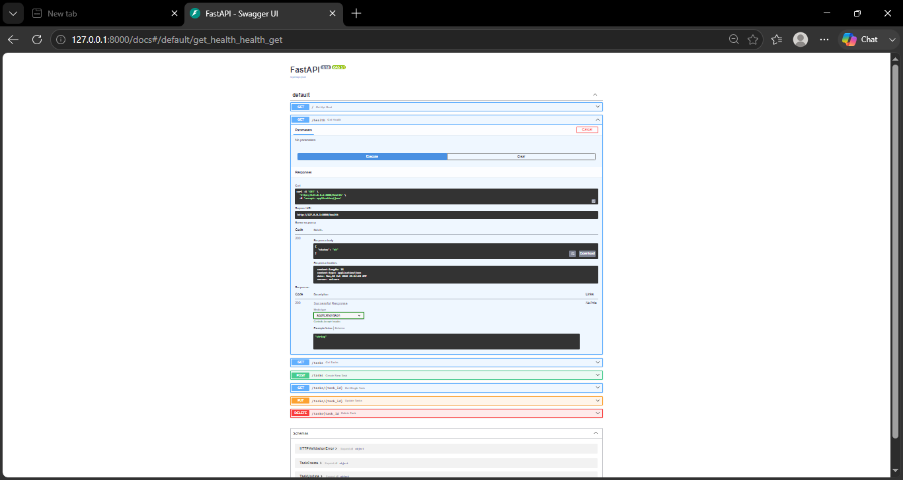

# 📝 FastAPI In-Memory To-Do CRUD API (BE-01)

A clean, production-grade asynchronous RESTful API for managing a task list built with **Python** and **FastAPI**. Designed adhering strictly to REST principles, type safety with Pydantic, explicit HTTP status codes, and comprehensive validation.

---

## 🛠️ Key Features
- **Full CRUD Operations**: Create, Read (All & Single), Update, and Delete tasks.
- **In-Memory Storage**: Fast execution without database dependencies for baseline REST benchmarking.
- **Strict Input Validation**: Utilizes **Pydantic** models to catch empty/blank inputs and return proper `400 Bad Request` status codes.
- **Standardized REST Status Codes**: Explicit `200 OK`, `201 Created`, `204 No Content`, `400 Bad Request`, and `404 Not Found`.
- **Interactive Documentation**: Auto-generated Swagger UI and ReDoc documentation.

---

## 🚀 How to Install & Run

Follow these steps to run the API locally on your machine:

### 1. Clone the Repository


```bash
git clone <YOUR-GITHUB-REPO-URL>
cd <YOUR-REPO-FOLDER>
```

# 1.Install dependencies:
Bash
pip install fastapi uvicorn pydantic

# 2.Run the server:

Bash
uvicorn main:app --reload
The server will start at http://127.0.0.1:8000


# ## 📡 API Endpoints Reference

| Method | Endpoint | Description | Request Body | Success Status | Error Status |

| `GET` | `/` | API Metadata & available endpoints | None | `200 OK` | - |
| `GET` | `/health` | Server health check endpoint | None | `200 OK` | - |
| `GET` | `/tasks` | Retrieve list of all tasks | None | `200 OK` | - |
| `GET` | `/tasks/{id}` | Retrieve a single task by ID | None | `200 OK` | `404 Not Found` |
| `POST` | `/tasks` | Create a new task | `{"title": "str"}` | `201 Created` | `400 Bad Request` |
| `PUT` | `/tasks/{id}` | Update task title and/or done status | `{"title": "str", "done": bool}` | `200 OK` | `400 Bad Request` / `404 Not Found` |
| `DELETE` | `/tasks/{id}` | Remove a task permanently | None | `204 No Content` | `404 Not Found` |


🧪 Sample Terminal Verification (curl -i)
Bash
# Creating a new task
curl -i -X POST [http://127.0.0.1:8000/tasks](http://127.0.0.1:8000/tasks) -H "Content-Type: application/json" -d "{\"title\": \"Deploy to Production\"}"

# Output Response:
# HTTP/1.1 201 Created
# content-type: application/json
# {"id": 4, "title": "Deploy to Production", "done": false}


## 📸 Interactive Documentation (Swagger UI)

FastAPI automatically generates interactive API documentation powered by Swagger UI. 

1. Ensure the API server is running locally (`uvicorn main:app --reload`).
2. Open your browser and navigate to: **`http://127.0.0.1:8000/docs`**
3. Test all CRUD operations interactively using the **"Try it out"** feature.




---

## 🤖 Stage 7: AI Rematch (AI vs Me)

### Prompt Used:
> *"Write a FastAPI in-memory CRUD API for a To-Do list with endpoints for GET /tasks, GET /tasks/{id}, POST /tasks, PUT /tasks/{id}, and DELETE /tasks/{id}. Ensure 404 for missing IDs, 400 for empty titles, 201 for post, and 204 for delete."*

### Comparison Highlights:
1. **What the AI did better:** Generated boilerplate code faster and provided built-in type annotations quickly.
2. **What the AI got wrong:** The AI returned a `200 OK` status with a JSON message for `DELETE` operations instead of returning an explicit `204 No Content` with an empty body as required by REST standards.
3. **What my prompt forgot:** I initially forgot to specify stripping whitespace from inputs (`.strip()`), which allowed blank string titles to bypass validation in the AI's version until corrected.


---

## 🗄️ Database Architecture & Persistence (SQLite)

### Why SQLite?
- **Zero-Configuration**: Serverless database contained within a single standalone file (`tasks.db`).
- **Data Persistence**: Solves the in-memory limitation by saving records permanently to disk across server restarts.
- **Auto-Initialization**: Database schema and tables are created automatically on application startup if missing.

### Database Location & Configuration
- **File Location**: `./tasks.db` (Ignored by `.gitignore` to keep user environments clean).
- **Run Command**: 
  ```bash
  uvicorn main:app --reload 

---
Manual SQL Query Execution (Stage 4)
Executed via DB Browser for SQLite to inspect active tasks:

#  SELECT * FROM tasks WHERE done = 0;


---

## 🤖 Stage 6: AI Rematch (AI vs Me)

### Prompt Used:
> "Write a FastAPI REST API for a To-Do list backed by SQLite using python's built-in sqlite3 library. Create a tasks table automatically on startup with columns id, title, and done. Seed three example tasks if the table is empty. Implement endpoints for GET /tasks, GET /tasks/{id}, POST /tasks, PUT /tasks/{id}, and DELETE /tasks/{id}. Ensure 404 for missing IDs, 400 for empty titles, 201 for post, and 204 for delete. Use parameterized queries for safety."

### Comparison Summary:
1. **What the AI did better:** Automatically generated type-hinting decorators and structured connection contexts cleanly.
2. **What the AI got wrong:** The AI forgot to use explicit `status.HTTP_204_NO_CONTENT` for the `DELETE` endpoint and initially returned a `200 OK` with a JSON payload instead.
3. **What my prompt forgot:** I forgot to specify handling whitespace-only inputs (`.strip()`), which allowed empty string spaces to pass as valid titles in the AI's version.